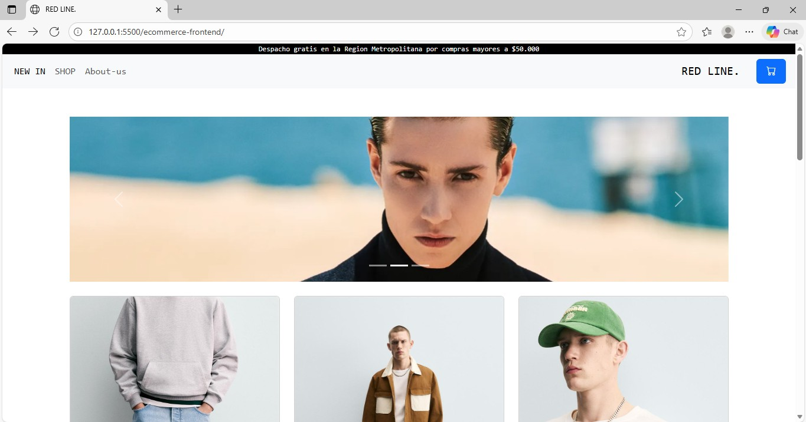
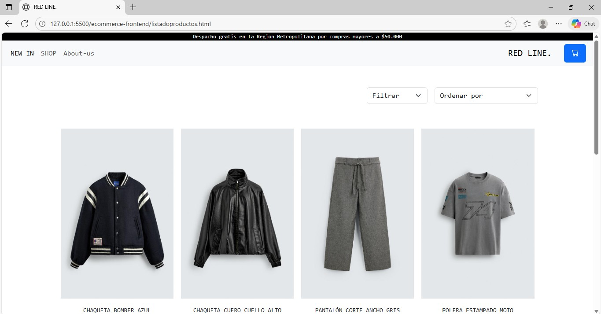
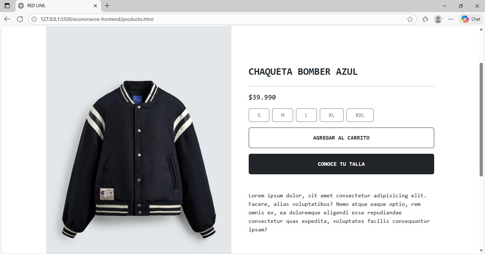

# M2 — E-commerce Frontend

## Descripción
Interfaz web de una tienda e-commerce con navegación, listado de productos, detalle de producto y footer.

## Tecnologías
- HTML5, CSS3 (bootstrap), JavaScript (vanilla)

## Ejecutar el proyecto
- http://127.0.0.1:5500/ecommerce-frontend/
- https://abrifb.github.io/ecommerce/

## Funcionalidades
- pagina de inicio con navbar y carrito de compras
- Listado de productos
- Página de detalle de producto con boton de compra y seleccionador de tallas
- Footer con información de la tienda

## Capturas
./asse

## Autor
Abraham Fuentes— https://github.com/abrifb/ecommerce

